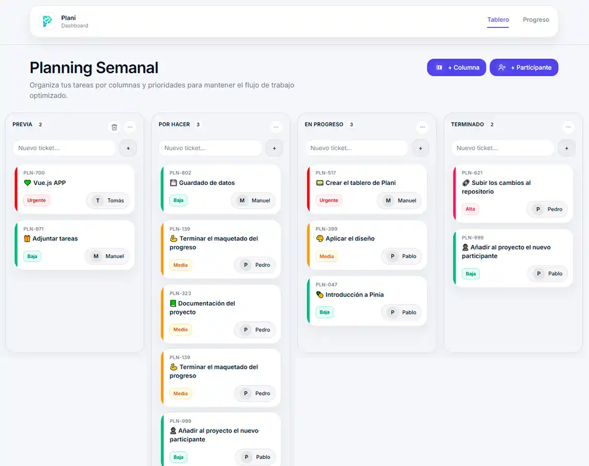

<div align="center">
  <a href="https://plani-board.netlify.app/board">
    
  </a>
  <p />
  <p>
    <b>
      A clean task planning tool to organize and track your work.
    </b>
  </p>

<p align="center">
    <a href="https://plani-board.netlify.app/">Live Demo</a>
    <span>&nbsp;&nbsp;✦&nbsp;&nbsp;</span>
    <a href="#-introduction">Introduction</a>
    <span>&nbsp;&nbsp;✦&nbsp;&nbsp;</span>
    <a href="#-stack">Stack</a>
    <span>&nbsp;&nbsp;✦&nbsp;&nbsp;</span>
    <a href="#-features">Features</a>
    <span>&nbsp;&nbsp;✦&nbsp;&nbsp;</span>
    <a href="#-project-structure">Project Structure</a>
    <span>&nbsp;&nbsp;✦&nbsp;&nbsp;</span>
    <a href="#-license">License</a>
</p>



</div>

## 📝 Introduction

Plani is a modern and responsive task management board inspired by the Kanban workflow.
Users can create custom columns, manage tickets with priorities and assignees, and track weekly progress through interactive analytics.
The project focuses on clean component architecture, scalable state management with Pinia, and a polished, user-friendly UI built with Vue 3 and TypeScript.

## 🛠️ Stack

- ✅ [**Vue 3**](https://vuejs.org/) – Progressive JavaScript framework for building interactive user interfaces.
- 🟦 [**TypeScript**](https://www.typescriptlang.org/) – Strongly typed JavaScript for scalable and maintainable code.
- 🍍 [**Pinia**](https://pinia.vuejs.org/) – State management library for Vue.
- ⚡ [**Vite**](https://vitejs.dev/) – Fast development build tool and bundler.
- 🎨 [**Tailwind CSS**](https://tailwindcss.com/) – Utility-first CSS framework for rapid UI development.
- 🧠 **LocalStorage API** – Persistent client-side state storage.
- ☁️ [**Netlify**](https://www.netlify.com/) – Deployment and hosting platform.
- 🧹 [**Prettier**](https://prettier.io/) – Opinionated code formatter for consistent styling.

## ✨ Features

- Kanban-style task management board
- Drag & drop ticket workflow
- Custom column creation with validation
- Priority system (Low, Medium, High)
- Participant assignment per ticket
- Weekly progress tracking & analytics
- Persistent state with local storage
- Fully responsive and modern UI

## 📁 Project Structure

```src/
├── app/
│   └── types/
│       └── board.ts
│
├── components/
│   ├── Board/
│   │   ├── BoardView.vue
│   │   ├── ColumnView.vue
│   │   └── TicketCard.vue
│   │
│   └── Ticket/
│       └── TicketDetailsModal.vue
│
├── pages/
│   ├── BoardPage.vue
│   └── ProgressPage.vue
│
├── router/
│   └── index.ts
│
├── stores/
│   └── board.ts
│
├── styles/
│   ├── main.css
│   ├── tokens.css
│   └── components.css
│
├── App.vue
└── main.ts
```

## 🔑 License

- This project is licensed under the [MIT](https://github.com/Ayoamaro/Plani/blob/master/LICENSE) License.
